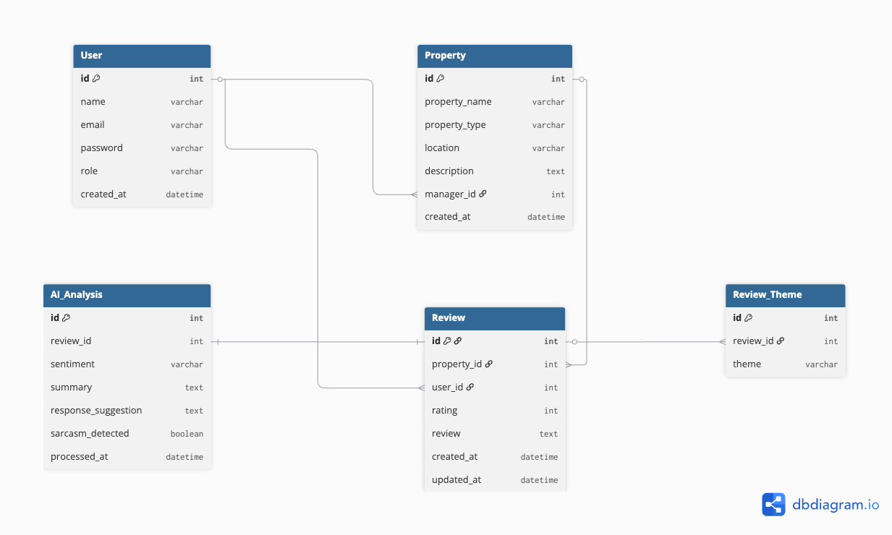

# GuestBook

AI-Powered Guest Feedback Intelligence Platform for Homestay Businesses.

---

## Project Description

GuestBook is a full-stack web application that helps homestay owners and property managers manage and analyze guest reviews from platforms such as Google Reviews, Booking.com, and TripAdvisor.

The platform stores guest reviews in a MongoDB database and presents them through an interactive dashboard, allowing users to search, filter, and manage feedback efficiently. It also integrates the Google Gemini API to perform AI-powered sentiment analysis, theme detection, review summarization, professional response generation, and sarcasm detection in real time.

---

# Live Demo

### Frontend (Vercel)

https://guestbook-review.vercel.app

### Backend API (Render)

https://guestbook-fpyp.onrender.com

### API Documentation (Swagger)

https://guestbook-fpyp.onrender.com/docs

---

# Key Features

- AI-powered review analysis using Google Gemini
- Automatic sentiment detection (Positive, Neutral, Negative)
- Automatic extraction of hospitality themes from guest reviews
- AI-generated review summaries
- Professional response suggestions for guest feedback
- Sarcasm detection in reviews
- Secure customer authentication with protected routes
- Interactive review management dashboard
- Advanced search and filtering
- Responsive UI with dark mode support

---

# AI Review Analysis Workflow

GuestBook uses the Google Gemini API to analyze guest reviews in real time.

Workflow:

1. Customer submits a guest review.
2. The frontend sends the review text to the FastAPI backend.
3. The backend forwards the request to Google Gemini.
4. Gemini returns structured JSON containing:
   - Sentiment
   - Themes
   - Summary
   - Suggested response
   - Sarcasm detection
5. The frontend displays the AI analysis before the review is submitted to the database.

---

# Tech Stack

| Layer | Technologies |
|--------|--------------|
| Frontend | Next.js, React.js, Tailwind CSS |
| Backend | FastAPI, Python, Pydantic |
| Database | MongoDB Atlas, PyMongo |
| Authentication | JWT Authentication, Google OAuth (NextAuth.js) |
| AI | Google Gemini 3.5 Flash API |
| Deployment | Vercel (Frontend), Render (Backend) |
| Version Control | Git, GitHub |

---

# Deployment Architecture

GuestBook is deployed as a cloud-based full-stack application.

- **Frontend:** Hosted on Vercel
- **Backend API:** Hosted on Render
- **Database:** MongoDB Atlas
- **AI Service:** Google Gemini API
- **Authentication:** JWT Authentication and Google OAuth

The frontend communicates with the FastAPI backend through REST APIs. The backend stores review data in MongoDB Atlas and interacts with the Gemini API to perform AI-powered review analysis.

---

# Why MongoDB?

MongoDB Atlas was selected because it is well suited for applications that manage semi-structured textual data like guest reviews.

Advantages include:

- Flexible document-based schema for review data
- Easy storage of large text fields without complex normalization
- JSON-like BSON documents integrate naturally with FastAPI
- Highly scalable cloud database
- Simple integration using PyMongo
- Suitable for storing AI-generated fields such as summaries, suggested responses, detected themes, and sentiment labels.

---

# Database Schema

The following schema represents the core database structure used by GuestBook. It illustrates the relationships between users, properties, guest reviews, AI analysis results, and detected review themes.



---

# Environment Variables

Create a `.env` file inside the **backend** folder.

Example:

```env
MONGO_URI=your_mongodb_connection_string
DATABASE_NAME=guestbook
COLLECTION_NAME=reviews

GEMINI_API_KEY=your_google_gemini_api_key
GEMINI_MODEL=models/gemini-3.5-flash
```

Create a `.env.local` file inside the **frontend** folder.

Example:

```env
NEXT_PUBLIC_API_URL=http://127.0.0.1:8000
```
The repository also includes a `.env.example` file containing the required environment variables with placeholder values.

---

# Project Setup

## 1. Clone the repository

```bash
git clone https://github.com/AbhijayChaudhary/guest-feedback-intelligence-platform.git
```

```bash
cd guest-feedback-intelligence-platform
```

---

## 2. Backend Setup

Navigate to the backend directory.

```bash
cd backend
```

Create a virtual environment.

```bash
python3 -m venv .venv
```

Activate the virtual environment.

### macOS / Linux

```bash
source .venv/bin/activate
```

### Windows

```bash
.venv\Scripts\activate
```

Install the required packages.

```bash
pip install -r requirements.txt
```

Start the FastAPI server.

```bash
uvicorn main:app --reload
```

The backend server will run at:

```
http://127.0.0.1:8000
```

Swagger API documentation:

```
http://127.0.0.1:8000/docs
```

---

## 3. Frontend Setup

Open another terminal.

Install dependencies.

```bash
npm install
```

Start the Next.js development server.

```bash
npm run dev
```

The frontend runs at:

```
http://localhost:3000
```

---

## Database Setup

Create a free MongoDB Atlas cluster.

Create a database (for example: `guestbook`).

Create a collection named `reviews`.

Copy your MongoDB connection string.

Inside the `backend` folder, create a `.env` file using the variables shown in `.env.example`.

Example:

```env
MONGO_URI=your_mongodb_connection_string
DATABASE_NAME=guestbook
COLLECTION_NAME=reviews

GEMINI_API_KEY=your_google_gemini_api_key
GEMINI_MODEL=models/gemini-3.5-flash
```

Start the backend server:

```bash
cd backend
source .venv/bin/activate      # macOS/Linux

# or

.venv\Scripts\activate         # Windows

uvicorn main:app --reload
```

On startup, the application will automatically connect to MongoDB Atlas and seed the database with sample reviews if the collection is empty.

---

# API Endpoints

## Authentication

| Method | Endpoint | Description |
|---------|----------|-------------|
| POST | `/api/auth/register` | Register a new user |
| POST | `/api/auth/login` | Authenticate a user and return a JWT |
| POST | `/api/auth/google` | Authenticate or register a user using Google OAuth |

## Reviews

| Method | Endpoint | Description |
|---------|----------|-------------|
| GET | `/api/reviews/` | Retrieve all guest reviews |
| GET | `/api/reviews/{id}` | Retrieve a review by ID |
| GET | `/api/reviews/search?q=` | Search guest reviews |
| POST | `/api/reviews/` | Create a new guest review |
| PUT | `/api/reviews/{id}` | Update an existing guest review |
| DELETE | `/api/reviews/{id}` | Delete a guest review |

## AI

| Method | Endpoint | Description |
|---------|----------|-------------|
| POST | `/api/ai/analyze-review` | Analyze a guest review using Google Gemini AI |

---

# Project Structure

```
GuestBook/
│
├── backend/
│   ├── data/
│   ├── middleware/
│   ├── models/
│   ├── routes/
│   │   ├── ai.py
│   │   ├── auth.py
│   │   └── reviews.py
│   ├── utils/
│   │   ├── database.py
│   │   ├── gemini_service.py
│   │   ├── jwt_handler.py
│   │   ├── password.py
│   │   ├── rate_limiter.py
│   │   └── seeding.py
│   ├── main.py
│   └── requirements.txt
│
├── frontend/
│   ├── app/
│   ├── assets/
│   ├── components/
│   ├── context/
│   ├── public/
│   ├── services/
│   │   └── api.js
│   ├── package.json
│   └── .env.example
│
├── PROMPTS.md
└── README.md
```

---

# Known Limitations (Free Tier)

The current deployment uses free cloud services for educational purposes.

- Render free-tier services may enter sleep mode after periods of inactivity. The first request may therefore take approximately 30–60 seconds while the backend wakes up.
- AI analysis depends on the availability and quota limits of the Google Gemini API.
- MongoDB Atlas free-tier storage and resource limits may affect scalability for large datasets.
- GuestBook currently supports manual review submission and does not yet integrate directly with external review platforms.

---

# Future Enhancements

The following features are planned for future development:

- AI-powered dashboard insights and trend visualization
- Multi-property management
- CSV review import
- Email notifications
- Export analytics reports (PDF/CSV)
- Review history and audit logs
- Role-based access control for property managers
- Integration with external review platforms (Google Reviews, Booking.com, TripAdvisor)

---

# License

This project has been developed for educational and internship learning purposes.